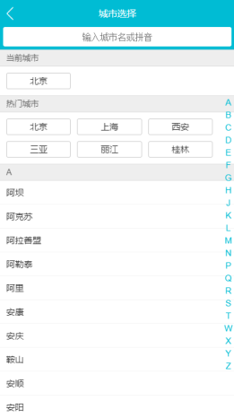

# vue-qunartravel

## 1. 项目描述

本项目是仿去哪儿App的H5页面。主要分为主页展示，城市选择，景点详情等。

本项目使用 vue + vue-cli 构建的单页面应用，项目采用了vue-route、axios、vuex 以及 ES6语法，使用模拟数据（mock），采用组件化思想搭建整个项目，从而使组件高度复用。

## 2. 如何运行

+ 克隆代码：`https://gitee.com/VueToLRH/Travel-qunar.git`
+ 安装依赖：`npm install`
+ 运行：`npm run start`
+ 打包：`npm run build`
+ ESlint检查：`npm run lint`

## 3. 项目安装插件及简介

+ src/assets/reset.css：用于重置CSS样式
+ src/assets/border.css：用于高倍屏，1像素的边框
+ fastclick：用于移动端某些机型点击事件，3秒钟的延迟问题
+ vue-awesome-swiper@2.6.7：用于制作轮播图效果
+ better-scroll: 解决移动端（已支持 PC）各种滚动场景需求的插件
+ 图片占位，可参考 [巧用margin/padding的百分比值实现高度自适应（多用于占位，避免闪烁）](https://segmentfault.com/a/1190000004231995)

## 3. 项目展示

     
